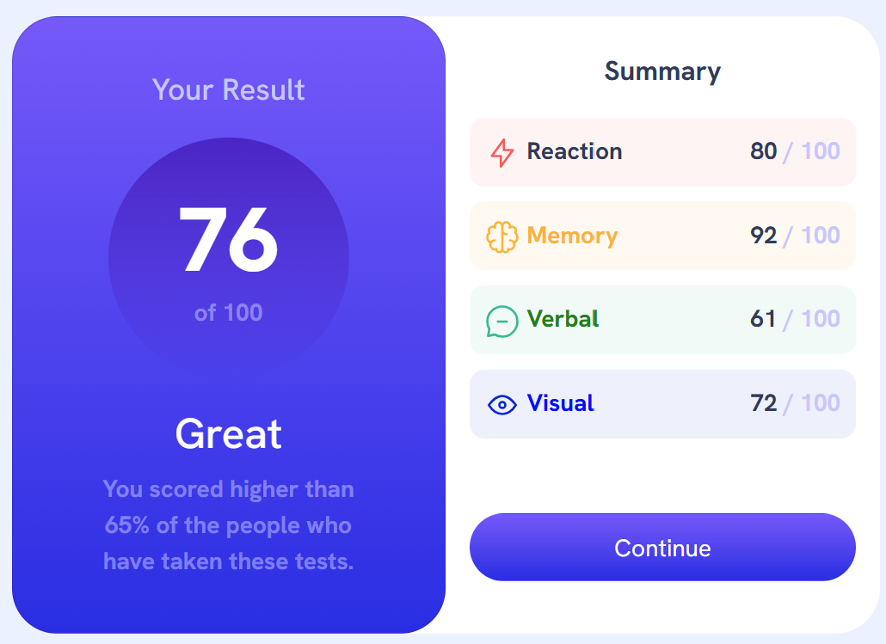
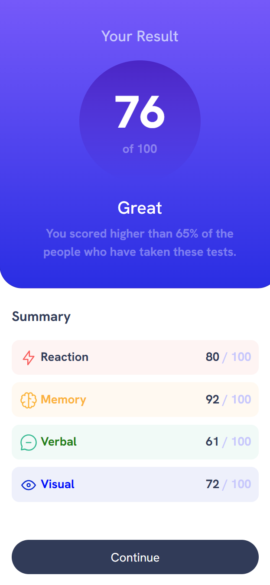

# Frontend Mentor - Results summary component solution

This is a solution to the [Results summary component challenge on Frontend Mentor](https://www.frontendmentor.io/challenges/results-summary-component-CE_K6s0maV). Frontend Mentor challenges help you improve your coding skills by building realistic projects. 

## Table of contents

- [Overview](#overview)
  - [The challenge](#the-challenge)
  - [Screenshot](#screenshot)
  - [Links](#links)
- [My process](#my-process)
  - [Built with](#built-with)
  - [What I learned](#what-i-learned)
- [Author](#author)


## Overview

### The challenge

Users should be able to:

- View the optimal layout for the interface depending on their device's screen size
- See hover and focus states for all interactive elements on the page
- **Bonus**: Use the local JSON data to dynamically populate the content

### Screenshot





### Links

- Solution URL: [Add solution URL here](https://www.frontendmentor.io/solutions/html-css-bootstrap-ejs-express-solution-f2Dc9WBb14)
- Live Site URL: [Add live site URL here](https://sonnen99.github.io/Challenge-results-summary-component/)

## My process

### Built with

- Semantic HTML5 markup
- CSS custom properties
- Bootstrap for card design
- @media breakpoints
- ejs for functionality
- Mobile-first workflow
- Refactoring

### What I learned

```html
<% content.forEach(function(element) { %>
  <div class="card summary-card" style="background-color: <%=element.background%>;">
    <div class="row">
      <div class="col category-text">
        " alt="icon">
        <p class="category" style="color: <%=element.color%>; ">
          <%= element.category %>
        </p>
      </div>
      <div class="col score-text">
        <p class="score">
          <%= element.score %>
        </p>
        <p class="hundred">
          / 100
        </p>
      </div>
    </div>
  </div>
<% }); %>
```

```js
app.get('/', function (req, res) {
    content = [];
    json.forEach(element => {
        content.push(element);
    });  
    res.render('index', { content: content });
});
```

## Author
- Frontend Mentor - [sonnen99](https://www.frontendmentor.io/profile/sonnen99)